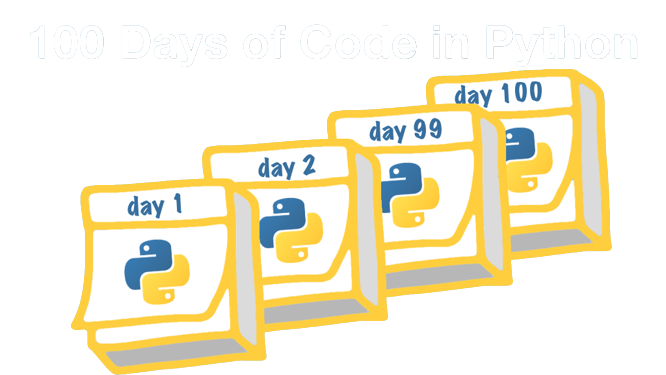

<h1>100 Days of Code: The Complete Python Pro Bootcamp</h1>

<h2>Estudo de Desenvolvimento em   Python</h2>

Dominando o Python: E criando 100 projetos em 100 dias. 
 
#100daysofcode

##### Contato:  

  

 

## Dia 01:

Neste primeiro dia, foram apresentados os conceitos básicos de programação:

- [x] Aprendemos sobre a utilização do ambiente Replit para programação.
- [x] Criamos uma conta no Replit e bifurcamos um projeto inicial.
- [x] Exploramos os elementos principais do Replit, como área de código, execução e console.
- [x] Apreendemos sobre o uso de aspas duplas para indicar strings.
- [x] Conscientizamos sobre a ocorrência comum de erros de sintaxe.
- [x] Aprendemos a buscar mensagens de erro no Google e utilizar recursos como o Stack Overflow para obter ajuda.
- [x] Destacamos a importância de observar a cor do código para identificar problemas.
- [x] Reconhecemos a necessidade de desenvolver habilidades para resolver problemas e garantir um código correto.

 Além disso, foi enfatizada a ocorrência comum de erros de sintaxe e a necessidade de aprender a identificá-los e resolvê-los, incluindo a busca por mensagens de erro no Google e o uso de sites como Stack Overflow para obter ajuda. Por fim, foi incentivado o desenvolvimento da habilidade de observar a cor do código para detectar problemas e garantir um código correto.

  

- [x] Aprendemos sobre a utilização de uma barra invertida seguida de 'n' para criar uma nova linha ao imprimir strings.
- [x] Exploramos a concatenação de strings usando o operador de adição (+).
- [x] Discutimos a importância de cuidar da formatação do código, evitando erros de indentação.
- [x] Reconhecemos a ocorrência comum de erros de sintaxe e indentação na programação.
- [x] Destacamos a utilidade da inteligência de código e do recurso de sugestões dos editores de texto.
- [x] Compreendemos a importância de prestar atenção aos detalhes durante a codificação para evitar erros.
- [x] Aprendemos a usar recursos online, como o Stack Overflow, para buscar soluções para erros de programação.
- [x] Concluímos que a prática e a resolução de erros são partes essenciais do processo de aprendizado da programação.

 

Exploramos vários conceitos relacionados ao uso de strings na programação. Inicialmente, aprendemos sobre a necessidade de repetir a impressão de linhas individuais várias vezes, caso quiséssemos exibir cada uma separadamente. Em seguida, foi introduzido um método mais eficiente para criar novas linhas utilizando a sequência de escape "\n", que representa uma nova linha.

Além disso, discutimos a concatenação de strings, que consiste em combinar diferentes cordas para formar uma única sequência de caracteres. O operador de adição (+) foi apresentado como uma forma de realizar essa concatenação. Exploramos exemplos em que a palavra "olá" foi concatenada com o nome "Angela", demonstrando como os espaços podem ser controlados ao realizar essa operação.

Um aspecto importante abordado, foi a necessidade de cuidar da formatação do código, especialmente em relação à indentação. Erros de indentação podem resultar em falhas na execução do código. É enfatizada a importância de começar o código no início da linha e evitar acidentalmente adicionar espaços ou separadores em frente às linhas de código.

Foi destacada a ocorrência comum de erros de sintaxe e indentação durante o processo de codificação. No entanto, ressaltou-se a importância de aprender com esses erros e reconhecê-los como oportunidades de aprendizado e aprimoramento.

Também foi visto a utilidade da inteligência de código presente em editores de texto, como o recurso de sugestões e auto-completar. Essas ferramentas podem auxiliar os programadores a evitar erros e escrever código de forma mais eficiente.

Por fim, ressalta-se a importância de prestar atenção aos detalhes durante a codificação, mesmo quando o cansaço ou distrações podem prejudicar a precisão. Recomenda-se fazer uso de recursos online, como o Stack Overflow, para buscar soluções e obter ajuda em caso de dúvidas ou problemas com o código.

Em suma, neste ponto, abrangemos uma série de conceitos fundamentais no uso de Strings na programação, destacando erros comuns, dicas de formatação e a importância da prática e resolução de problemas para o aprendizado eficaz da programação.

 

- [x] Introdução da função de entrada (input function) que permite solicitar dados ao usuário.
- [x] Utilização da sintaxe da função de entrada, substituindo a palavra "print" pela palavra "input" e fornecendo um prompt entre parênteses.
- [x] Exibição do prompt ao usuário e aguardo pela entrada de dados.
- [x] Armazenamento dos dados fornecidos pelo usuário em uma variável para uso posterior.
- [x] Possibilidade de utilizar os dados fornecidos em operações, como concatenação de strings.
- [x] Sugestão do uso de ferramentas de depuração, como o Thonny, para acompanhar a execução do código passo a passo.
- [x] Destaque para a importância de adicionar comentários ao código para explicar o propósito de linhas ou conceitos específicos.
- [x] Comentários são linhas de texto precedidas pelo símbolo "#" e são ignorados durante a execução do código.
- [x] Comentários podem melhorar a legibilidade e facilitar a compreensão do código.

Esse resumo resume os principais pontos abordados na seção.

 

Neste ponto, foi introduzida uma função diferente chamada função de entrada (input function). Ao contrário da função de impressão, que apenas exibe informações na tela, a função de entrada permite que o usuário forneça dados para o programa. Ao utilizar a função de entrada, é possível exibir um prompt ou mensagem ao usuário, solicitando que ele forneça algum tipo de entrada.

A sintaxe da função de entrada é semelhante à função de impressão. No lugar da palavra "print", utilizamos a palavra "input". Dentro dos parênteses, podemos adicionar um texto ou prompt para orientar o usuário sobre o tipo de dados que se espera.

Quando o código é executado, a função de entrada exibirá o prompt e aguardará a entrada do usuário. Após o usuário digitar os dados e pressionar "Enter", o programa continuará sua execução e poderá utilizar esses dados fornecidos.

Um exemplo mostrado, é a utilização da função de entrada para solicitar o nome do usuário. O dado fornecido pelo usuário é armazenado em uma variável, substituindo a chamada da função de entrada. Em seguida, o programa pode utilizar essa variável para realizar operações, como a concatenação com outras strings.

Além disso, foi destacada a importância de adicionar comentários ao código para explicar o propósito de determinadas linhas ou conceitos. Os comentários são linhas de texto precedidas pelo símbolo "#" e são ignorados pelo computador durante a execução do código. Comentários podem ser úteis para tornar o código mais legível e facilitar a compreensão do funcionamento do programa.

Em resumo, a função de entrada foi apresentada como uma forma de permitir a interação do usuário com o programa, fornecendo dados que podem ser utilizados para diferentes fins. Também foi mencionado o uso de comentários e a possibilidade de depurar o código passo a passo para melhor compreensão do funcionamento.

 

Nesta ponto da lição, aprendemos sobre o conceito de variáveis em Python. Uma variável é uma forma de armazenar e acessar dados em nosso código. Através da função de entrada (input function), podemos receber dados do usuário e atribuí-los a uma variável. Isso nos permite referenciar esses dados posteriormente em nosso código.

A sintaxe para criar uma variável é bastante simples: nome_da_variavel = valor. Podemos atribuir qualquer tipo de valor a uma variável, como uma string, um número inteiro ou um valor booleano.

Uma vez que uma variável é criada, podemos usá-la em diferentes partes do nosso código. Podemos imprimir o valor armazenado em uma variável usando a função print, por exemplo.

Além disso, as variáveis são mutáveis, o que significa que podemos alterar seu valor ao longo do programa. Podemos atribuir um novo valor a uma variável existente simplesmente usando o sinal de igual (=) novamente.

Utilizar variáveis em nosso código é útil para facilitar a legibilidade e a reutilização de dados. Em vez de repetir trechos de código, podemos armazenar os dados em variáveis e referenciá-los conforme necessário.

Ao final da lição, foi proposto um desafio de código para aplicar o conhecimento adquirido sobre variáveis.

Em resumo, nesta lição aprendemos:
- [x] O conceito de variáveis em Python e sua utilidade.
- [x] Como atribuir valores a variáveis.
- [x] A possibilidade de usar variáveis em diferentes partes do código.
- [x] A mutabilidade das variáveis e a capacidade de alterar seus valores.
- [x] O uso de variáveis para melhorar a legibilidade e a reutilização de dados.
 

Por fim, aprendemos sobre a importância de nomear as variáveis de forma significativa e legível em Python. Embora tenhamos liberdade para escolher os nomes das variáveis, é essencial seguir algumas boas práticas. Aqui estão os principais pontos abordados:

1. Legibilidade: É fundamental escolher nomes que façam sentido e sejam compreensíveis. Isso facilita a leitura e o entendimento do código, tanto para nós mesmos quanto para outros desenvolvedores que possam ler o código posteriormente.

2. Palavras-chave e funções: Evite usar palavras-chave do Python, como "print" ou "input", como nomes de variáveis. Isso pode causar confusão e destacar sintaxe incorreta no código.

3. Espaços e caracteres especiais: Os nomes das variáveis não podem conter espaços, mas é permitido usar sublinhados para separar palavras. Além disso, evite o uso de caracteres especiais ou números no início do nome da variável.

4. Ortografia consistente: Certifique-se de escrever corretamente os nomes das variáveis em todo o código. Erros de ortografia podem causar erros de nome (NameError) ao tentar acessar a variável.

5. Reatribuição: As variáveis podem ser reatribuídas a novos valores ao longo do programa. No entanto, é importante manter a consistência no uso do nome da variável para evitar confusões e erros.

6. Boas práticas: É recomendável seguir as convenções de estilo do Python, como usar letras minúsculas e separar palavras com sublinhados (snake_case) para nomes de variáveis.

Em resumo, nesta lição, aprendemos sobre a importância de nomear variáveis de forma clara e legível, seguindo algumas boas práticas. Isso ajuda a melhorar a compreensão do código e evita erros relacionados a nomes de variáveis incorretos ou confusos.

## Concluindo

Nesta primeiro dia, aprendemos conceitos fundamentais sobre strings, impressão, entrada de dados e variáveis em Python. Recapitulando o que foi estudado:

1. Strings: As strings são sequências de caracteres e podem ser representadas entre aspas simples ou duplas. A função "print" é usada para exibir strings na saída.

2. Impressão: A função "print" é utilizada para exibir informações na saída do programa. Podemos imprimir valores literais ou usar variáveis para exibir dados dinâmicos.

3. Caracteres especiais: Podemos usar caracteres especiais, como "\n" para representar uma nova linha, para formatar a exibição de strings.

4. Entrada de dados: A função "input" permite que o programa solicite dados ao usuário. Os dados inseridos pelo usuário podem ser armazenados em variáveis para uso posterior.

5. Variáveis: As variáveis são usadas para armazenar dados em um programa. Podemos atribuir um valor a uma variável usando o sinal de igual (=). O nome da variável deve ser escolhido de forma significativa e seguir as regras de nomenclatura do Python.

6. Concatenação de strings: Podemos combinar strings usando o operador de adição (+) para criar uma nova string concatenada.

7. Comentários: Comentários são trechos de texto no código que são ignorados pelo interpretador do Python. Eles são usados para adicionar explicações e tornar o código mais compreensível.

Ao aplicar esses conceitos, somos capazes de criar programas mais interativos, manipular dados de entrada e exibir resultados de saída personalizados. A compreensão desses fundamentos é essencial para construir programas mais complexos e resolver problemas usando Python.

Continuar praticando esses conceitos, resolvendo desafios de programação e explorando recursos adicionais do Python me permitirá  desenvolver habilidades sólidas de programação e expanda seu conhecimento na linguagem.
