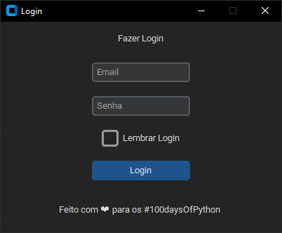

<h1>100 Days of Code: The Complete Python Pro Bootcamp</h1>

<h2>Estudo de Desenvolvimento em   Python</h2>

 Dominando o Python em 100 dias. 
 
#100daysofcode

##### Contato:  

  

           

 

## Dia 11: 
 
####Janelas Bonitas no Python - Sistema de Login com CustomTkinter
 

Ao estudar esse código, pude aprender sobre a criação de janelas bonitas no Python usando a biblioteca `customtkinter`. Comecei importando o módulo `customtkinter`, que parece ser uma extensão personalizada do `tkinter` padrão.

Em seguida, criei a janela principal da aplicação utilizando a classe `CTk` fornecida pela biblioteca. Defini o título da janela como "Login" e determinei uma geometria de 400x300 pixels. Também configurei a janela para não ser redimensionável.

Uma parte interessante foi a capacidade de personalizar a aparência da aplicação. Utilizei a função `set_appearance_mode('dark')` para definir o modo de aparência como escuro, o que provavelmente resulta em uma interface escura e elegante. Em seguida, utilizei a função `set_default_color_theme('dark-blue')` para definir o tema de cores como "dark-blue", que afeta a aparência dos widgets.

Após configurar a janela principal, criei vários widgets para a interface de login. Utilizei a classe `CTkLabel` para criar um rótulo de texto com a mensagem "Fazer Login" e o posicionei na janela com um espaçamento de 10 pixels em todas as direções.

Em seguida, criei duas entradas de texto usando a classe `CTkEntry`. Uma foi usada para o usuário e a outra para a senha. Defini um texto de espaço reservado para cada uma delas, indicando "Email" para o usuário e "Senha" para a senha. Também configurei a entrada de senha para ocultar os caracteres digitados, exibindo asteriscos em vez disso.

Adicionei um checkbox de lembrar login usando a classe `CTkCheckBox`, com o texto "Lembrar Login". Novamente, posicionei-o na janela com um espaçamento de 10 pixels.

Para o botão de login, utilizei a classe `CTkButton` e defini o texto como "Login". Também atribuí a função `clique()` como a função de callback, que será chamada quando o botão for clicado.

Por fim, criei um rótulo de rodapé usando a classe `CTkLabel` com a mensagem "Feito com ❤ para os #100daysOfPython". Posicionei-o na parte inferior da janela com um espaçamento de 5 pixels à esquerda e à direita, e 20 pixels acima e abaixo.

Após configurar todos os widgets, chamei a função `mainloop()` na janela principal para iniciar o loop de eventos. Isso permite que a interface seja exibida e aguarde a interação do usuário.

No geral, estudar esse código me permitiu entender como criar janelas bonitas em Python usando a biblioteca `customtkinter`. Aprendi a personalizar a aparência da aplicação, criar e posicionar diferentes tipos de widgets, e atribuir funções de callback a botões. Essas habilidades serão úteis para criar interfaces atraentes e funcionais em futuros projetos.

 

 Aqui está uma descrição detalhada do que foi estudado: 

1. Importação do módulo `customtkinter`: O código começa importando a biblioteca `customtkinter`, que parece ser uma extensão personalizada para o módulo padrão `tkinter`. A extensão `customtkinter` permite criar janelas e widgets com aparência personalizada.

2. Criação da janela principal: Uma instância de `CTk` é criada como a janela principal da aplicação. Ela recebe o título "Login" e possui uma geometria definida de 400x300 pixels. A janela também é configurada como não redimensionável.

3. Definição do modo de aparência e tema de cores: A função `set_appearance_mode()` é usada para definir o modo de aparência da aplicação como "dark", o que provavelmente resulta em uma aparência escura. A função `set_default_color_theme()` é usada para definir o tema de cores como "dark-blue", que afeta a aparência dos widgets.

4. Criação de widgets: Vários widgets são criados e adicionados à janela principal usando a classe `CTkLabel`, `CTkEntry`, `CTkCheckBox` e `CTkButton` da biblioteca `customtkinter`. Aqui está uma descrição de cada widget:

   - `CTkLabel`: Um rótulo de texto é criado com o texto "Fazer Login". Ele é empacotado na janela principal com um espaçamento de 10 pixels em todas as direções.
   
   - `CTkEntry`: Duas entradas de texto são criadas, uma para o usuário e outra para a senha. Elas são empacotadas na janela principal com um espaçamento de 10 pixels em todas as direções. A entrada de usuário tem um texto de espaço reservado definido como "Email", e a entrada de senha tem um texto de espaço reservado definido como "Senha". Além disso, a entrada de senha é configurada para exibir os caracteres digitados como asteriscos para ocultar a senha.
   
   - `CTkCheckBox`: Uma caixa de seleção é criada com o texto "Lembrar Login". Ela é empacotada na janela principal com um espaçamento de 10 pixels em todas as direções.
   
   - `CTkButton`: Um botão de login é criado com o texto "Login". Ele é empacotado na janela principal com um espaçamento de 10 pixels em todas as direções. Além disso, é atribuída a função `clique()` ao botão, que será chamada quando o botão for clicado.
   
   - `CTkLabel`: Um rótulo de rodapé é criado com o texto "Feito com ❤ para os #100daysOfPython". Ele é empacotado na janela principal com um espaçamento de 5 pixels à esquerda e à direita e 20 pixels acima e abaixo.

5. Execução da janela: A função `mainloop()` é chamada na janela principal para iniciar o loop de eventos e permitir a interação do usuário com os widgets. A partir desse ponto, a janela é exibida e espera por ações do usuário.

Em resumo, o código estudado mostra como criar uma janela de login estilizada usando a biblioteca `customtkinter` em Python, com vários widgets, como rótulos, entradas de texto, caixas de seleção e botões.

 
 
 
Feito com ❤ para os #100daysOfPython 
 
 

<a href="../readme.md">Página Inicial</a> 