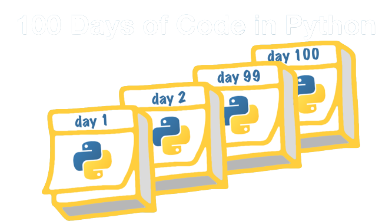
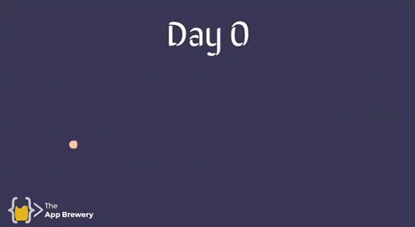

<h1>100 Days of Code: The Complete Python Pro Bootcamp</h1>

<h2>Estudo de Desenvolvimento em   Python</h2>

Dominando o Python em 100 dias. 
 
#100daysofcode

##### Contato:  

  

## Objetivos do desafio:

# Estudo Abrangente de Ferramentas e Tecnologias

Neste estudo abrangente, cobrirei uma enorme quantidade de ferramentas e tecnologias. Aqui está uma visão geral das áreas abordadas:

| Área                         | Ferramentas e Tecnologias        |
|------------------------------|----------------------------------|
| Python 3                     | PyCharm, Jupyter Notebook, Google Colab, Python Scripting and Automation, Python Game Development, Web Scraping, Beautiful Soup, Selenium Web Driver, Request, WTForms |
| Data Science                 | Pandas, NumPy, Matplotlib, Plotly, Scikit-learn, Seaborn, Turtle |
| Python GUI Desktop App Development | Tkinter, CustomTkinter |
| Front-End Web Development    | HTML 5, CSS 3, Bootstrap 4       |
| Web+                         |         Django                   |
| Version Control              |         Git, GitHub              |
| Backend Web Development      | Flask, REST, APIs, Databases (SQL, SQLite, PostgreSQL), Authentication |
| Web Design                   |                                  |
| Deployment                   | GitHub Pages, Heroku, GUnicorn   |

 <h1>
   🚀  Mão no Código 
</h1> 

Dia | Estudos | Projeto
--------- | ----------------- | -------- 
1 |<a href="dias/dia01.md">Tipos Primitivos com Python</a> | <a href="projetos/dia01_gerador_nomes_bandas.py">Gerador de nomes para Bandas</a>  
2 | <a href="dias/dia02.md">Estruturas de dados com Python</a> | <a href="projetos/dia02_calculadora_de_gorjetas.py ">Calculadora de Gorjetas</a>
3 | <a href="dias/dia03.md">Controle de Fluxo com Estruturas Condicionais</a> | <a href="projetos/dia03_ilha_do_tesouro.py">Ilha do Tesouro</a>
4 | <a href="dias/dia04.md">Erros de índice e listas aninhadas</a> | <a href="projetos/dia04_pedra_papel_tesoura.py">Pedra, Papel e Tesoura</a>
5 | <a href="dias/dia05.md">Coneceitos de Loops </a> | <a href="projetos/dia05_gerador_de_senhas.py">Gerador de PassWords seguras </a>
6 | <a href="dias/dia06.md">Criando CRUD SQLite </a> | <a href="extras/my_book_shelf/readme.md">MyBookShelf </a>
7 | <a href="dias/dia07.md">Frontend: Criação de frames  </a> | <a href="extras/my_book_shelf/readme.md">Projeto MyBookShelf </a>
8 | <a href="dias/dia08.md">Frontend: Criação de labels e entry  </a> | <a href="extras/my_book_shelf/readme.md">Projeto MyBookShelf </a>
9 | <a href="dias/dia09.md"> criação de botões e lógica de resultado </a> | <a href="extras/my_book_shelf/readme.md">Projeto MyBookShelf </a>
10 | <a href="dias/dia10.md"> Controle de Fluxos </a> | <a href="projetos/dia10_maquina_de_cafe.py">Projeto Máquina de Café </a>
11 | <a href="dias/dia11.md"> Estudo CustomTKinter </a> | <a href="./extras/janela_login.py"> Tela de Login Customizada </a>
12 | <a href="dias/dia12.md"> Programação Orientada a Objetos </a> | <a href="projetos/dia12_maquina_cafe_poo.py"> Máquina de Café com POO </a>
13 | <a href="dias/dia13.md"> Criação de classes personalizadas em Python </a> | <a href="projetos/dia12_maquina_cafe_poo.py"> Máquina de Café com POO </a>
14 | <a href="dias/dia14.md"> Módulo de turtle Python </a> | <a href="projetos/dia12_maquina_cafe_poo.py"> Máquina de Café com POO </a>

---

N°. | Projetos Extras
-- | -----------------
01 | <a href="./extras/tela.py">Criando uma interface Gráfica com Python</a>
02 | <a href="./extras/odd.py">Criando um programa que mostra as horas da Sorte</a>
03 | <a href="./extras/calculadora_do_amor.py">Criando uma Calculadora do Amor</a>
04 | <a href="./extras/love.py">Desenhando um Coração na Tela</a>
05 | <a href="./extras/my_book_shelf/readme.md">MyBookShelf - Catalogador de Livros</a>
06 | <a href="./extras/janela_login.py">Tela de Login Customizada</a>

 
 
 
 
 

### Estudos em Constante Atualização
#### 

 
 
 
Feito com ❤ para os #100daysOfPython 

